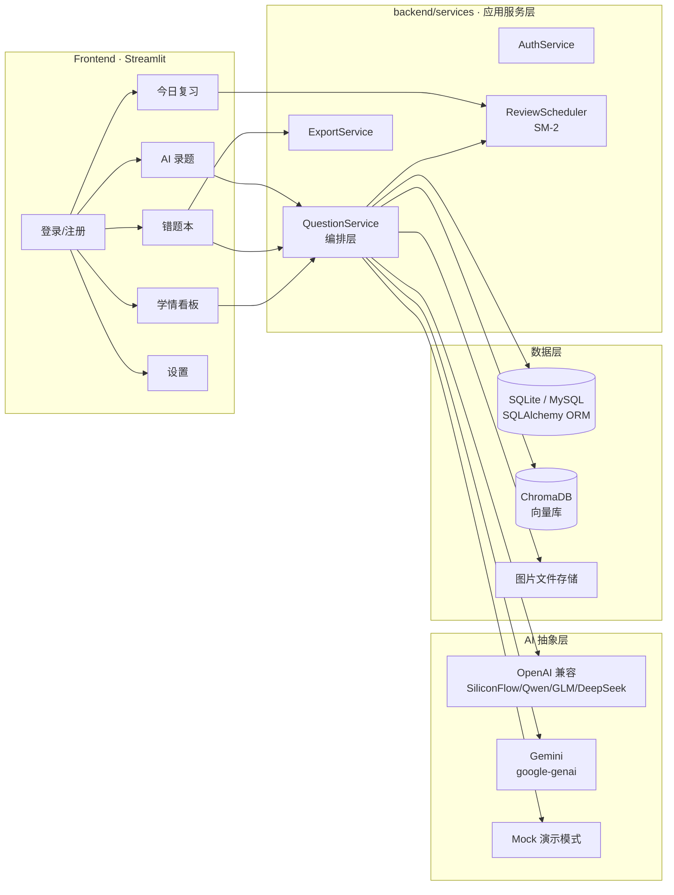
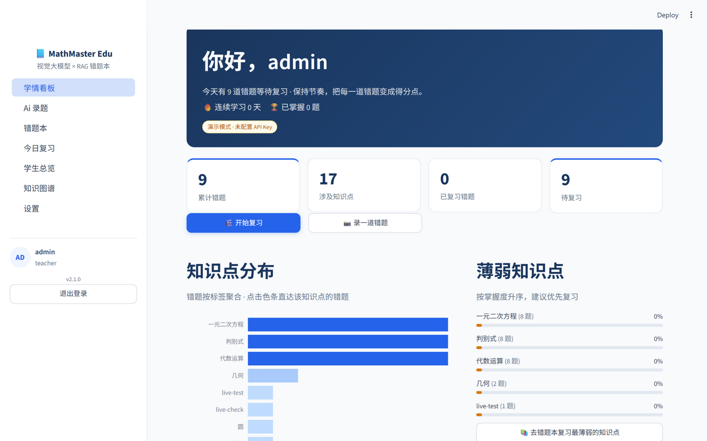
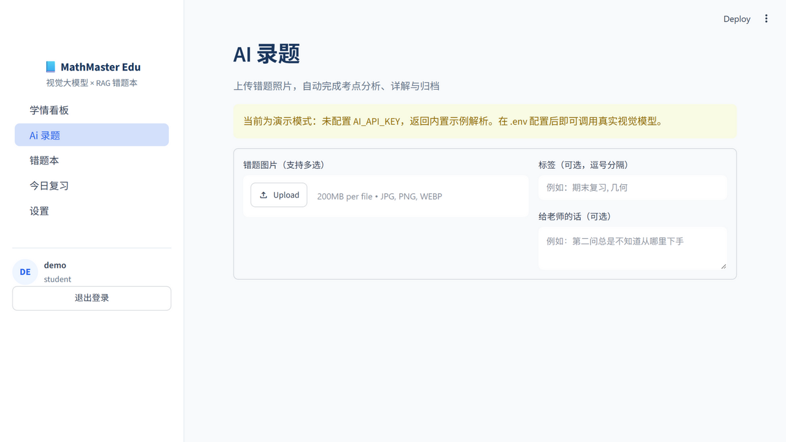
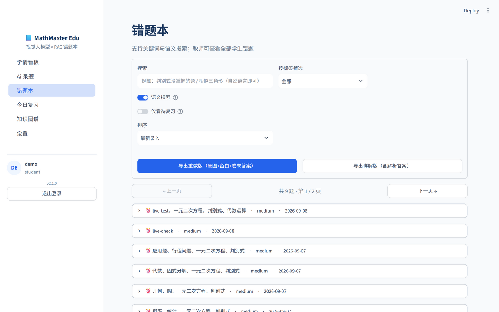
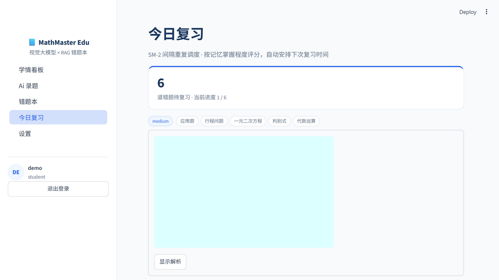

# 📘 MathMaster Edu — 基于视觉大模型与 RAG 的智能错题本

> **让错题管理像呼吸一样简单。** 拍照录入 → AI 结构化解析 → 向量归档 → 间隔重复复习 → 学情看板。
>
> A production-grade Smart Wrong-Question Notebook powered by a Vision LLM, RAG retrieval, and spaced-repetition scheduling.


[](https://github.com/lii-lii321/Math_Tutor_RAG/actions/workflows/ci.yml)


---

## ✨ 项目亮点 (Highlights)

| 能力 | 说明 |
|---|---|
| 📸 **AI 拍照录题** | 上传手写作业/试卷照片，视觉大模型识别题目并输出**结构化解析**（考点、分步讲解、答案、难度、易错原因、变式题），基于 Pydantic Schema 约束输出并稳健解析 |
| 🔁 **多模型提供商** | 统一 Provider 抽象：一套代码对接 **SiliconFlow / 通义千问 / 智谱 GLM / DeepSeek / OpenAI / Ollama / Gemini**，更换 `AI_BASE_URL` + `AI_MODEL` 即可切换；无 Key 时自动进入演示模式，克隆即可跑通 |
| 🧠 **RAG 向量检索** | ChromaDB 持久化向量库：错题解析自动嵌入入库；**「举一反三」相似题召回**、错题本**语义搜索**（自然语言找题）；向量库故障自动降级为关键词检索 |
| ⏰ **间隔重复复习** | 内置 **SM-2 算法**（Anki 同源）：闪卡式复习，按记忆质量自动调度下次复习时间，对抗遗忘曲线 |
| 💬 **追问讲题** | 每道错题内置多轮对话（Chat UI）：带题目上下文的多轮讲题，上下文自动截断防超限 |
| 📊 **学情看板** | 知识点分布、**标签级掌握度估算**（结合复习表现与调度间隔）、薄弱知识点 Top N、近 14 天录入趋势 |
| 🖨️ **一键组卷导出** | 按筛选结果生成可打印 Word 复习卷，保留题目原图与答题留白 |
| 🔐 **生产级安全** | bcrypt 密码哈希、登录失败延迟、Pydantic 入参校验、SQL 参数化查询 |
| 🧪 **工程化** | pytest 41 用例、ruff、GitHub Actions CI（lint + 3 版本矩阵测试 + Docker 构建）、Docker Compose 一键部署 |

## 🏗️ 架构 (Architecture)



**分层原则**：界面层（`frontend/`）只依赖应用服务（`QuestionService` 等）；服务层通过 Repository 访问数据库；AI 提供商与向量库均可替换/降级。配置集中在 `backend/config.py`（pydantic-settings 校验）。

## 🖼️ 界面速览 (Screenshots)

| 学情看板 | AI 录题 |
|---|---|
|  |  |
| **错题本** | **今日复习（SM-2 闪卡）** |
|  |  |

## 🚀 快速开始 (Quick Start)

### 方式一：本地运行（推荐 Python 3.10+）

```bash
git clone https://github.com/lii-lii321/Math_Tutor_RAG.git
cd Math_Tutor_RAG

python -m venv .venv
.venv\Scripts\pip install -r requirements.txt      # Windows
# source .venv/bin/activate && pip install -r requirements.txt   # macOS/Linux

streamlit run app.py
```

打开 http://localhost:8501 ，使用种子账号登录：

| 账号 | 密码 | 角色 |
|---|---|---|
| `admin` | `admin123` | 教师（可查看全部学生错题） |
| `demo` | `demo123` | 学生 |

> 未配置 AI Key 时应用以**演示模式**运行（返回内置示例解析），完整流程均可体验。

### 方式二：Docker 一键部署

```bash
docker compose up -d --build
# 访问 http://localhost:8501，数据持久化于 named volume
```

### 启用真实 AI 模型

复制 `.env.example` 为 `.env`，任选一家 OpenAI 兼容服务填入即可（也可接 Gemini 或本地 Ollama）：

```ini
AI_PROVIDER=openai_compatible
AI_BASE_URL=https://api.siliconflow.cn/v1
AI_API_KEY=sk-xxxx
AI_MODEL=Qwen/Qwen2.5-VL-32B-Instruct
```

可选：接入远程中文嵌入模型提升检索效果（默认使用 ChromaDB 内置本地模型，零外部依赖）：

```ini
EMBEDDING_BASE_URL=https://api.siliconflow.cn/v1
EMBEDDING_API_KEY=sk-xxxx
EMBEDDING_MODEL=BAAI/bge-m3
```

## 📖 功能导览

1. **AI 录题** — 上传错题照片 → 获得考点分析 / 分步讲解 / 答案 / 难度 / 易错原因 / 变式练习 → 自动归档并写入向量库 → 展示「举一反三」相似历史错题。
2. **错题本** — 关键词 + 语义双路搜索；按标签筛选；在线编辑（编辑后向量索引同步更新）；批量删除；一键导出 Word 复习卷；**追问讲题**多轮对话。
3. **今日复习** — 闪卡式复习：看题回忆 → 显示解析 → 按掌握程度评分（忘了/勉强/记得/秒懂）→ SM-2 自动安排下次复习时间。
4. **学情看板** — 累计错题、待复习数、知识点分布环形图、薄弱知识点掌握度条、近 14 天录入趋势。

## 🧪 测试与质量

```bash
pip install -r requirements-dev.txt
pytest -v          # 41 个用例：认证 / 仓储 / SM-2 调度 / AI 解析 / RAG / 统计 / 导出
ruff check .       # 静态检查
```

GitHub Actions 在每次 push / PR 时执行：`ruff lint → pytest (3.10/3.11/3.12 矩阵) → Docker 构建`。

## 📁 目录结构

```
Math_Tutor_RAG/
├── app.py                     # Streamlit 入口（路由 + 侧边栏）
├── backend/
│   ├── config.py              # pydantic-settings 配置中心
│   ├── database.py            # SQLAlchemy 引擎 / 会话 / 初始化
│   ├── models/
│   │   ├── orm.py             # User / Question / ReviewLog
│   │   └── schemas.py         # Pydantic 契约（含 AI 结构化输出 Schema）
│   ├── repositories/          # 数据访问层（用户 / 错题）
│   ├── services/
│   │   ├── ai/                # AI 提供商抽象：OpenAI 兼容 / Gemini / Mock
│   │   ├── rag.py             # ChromaDB 向量库封装（含降级策略）
│   │   ├── review.py          # SM-2 间隔重复调度器
│   │   ├── stats.py           # 标签统计 / 掌握度 / 活跃度
│   │   ├── auth.py            # 认证服务
│   │   ├── export.py          # Word 组卷导出
│   │   └── question_service.py# 错题编排服务（界面层唯一入口）
│   └── utils/                 # 日志 / 密码哈希
├── frontend/
│   ├── pages/                 # auth / dashboard / tutor / notebook / review / settings
│   ├── common.py              # 样式、缓存、公共组件
│   └── assets/style.css       # MUJI 极简主题
├── tests/                     # pytest 测试套件
├── docs/ARCHITECTURE.md       # 架构决策说明
├── Dockerfile / docker-compose.yml
└── .github/workflows/ci.yml   # lint + 测试矩阵 + Docker 构建
```

## 🗺️ 路线图 (Roadmap)

- [ ] 知识点图谱可视化（标签共现网络）
- [ ] PostgreSQL 支持；对象存储（S3/OSS）托管题目图片
- [ ] OpenTelemetry 观测埋点；FastAPI 网关化以便多端复用

## 📄 License

[MIT](LICENSE)
