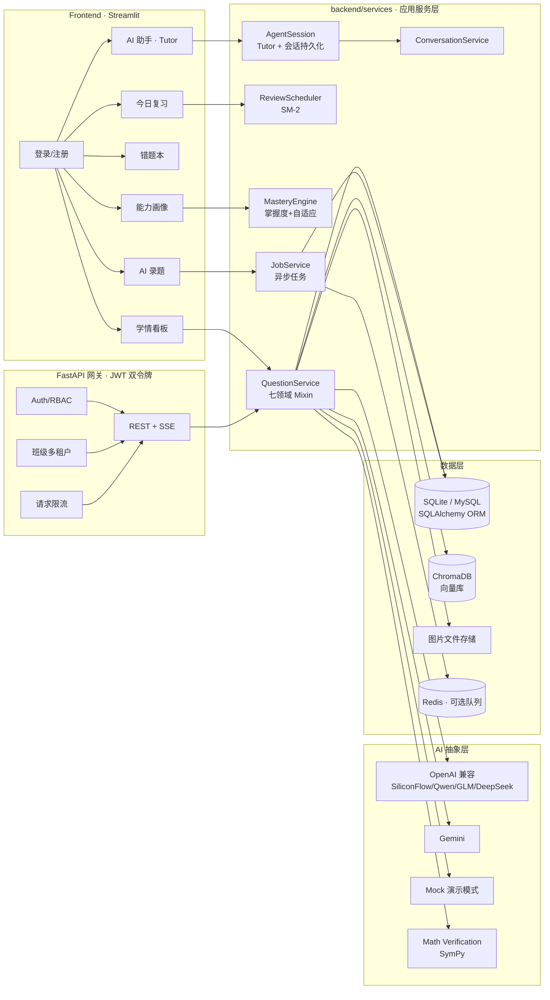
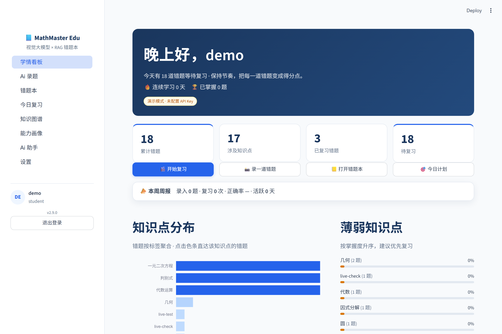
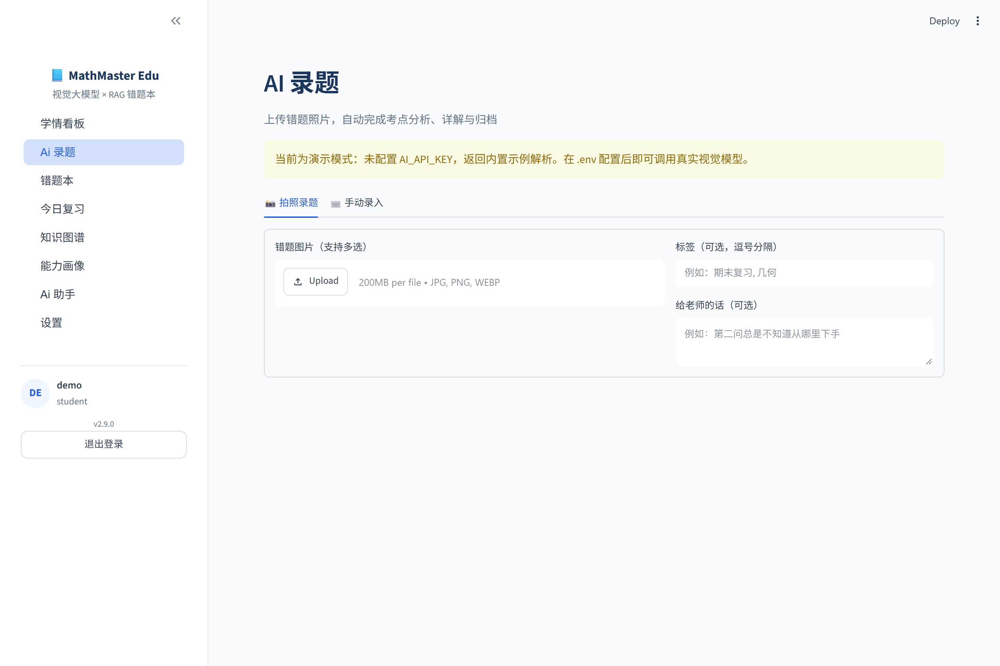
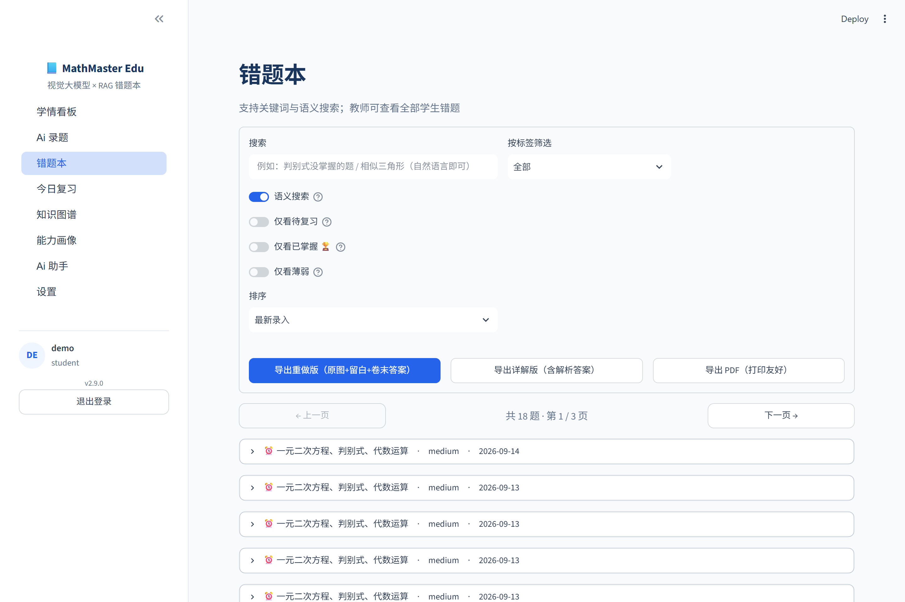
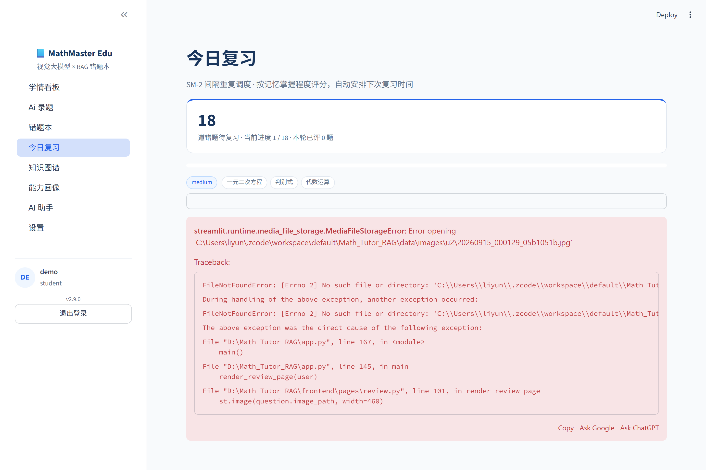
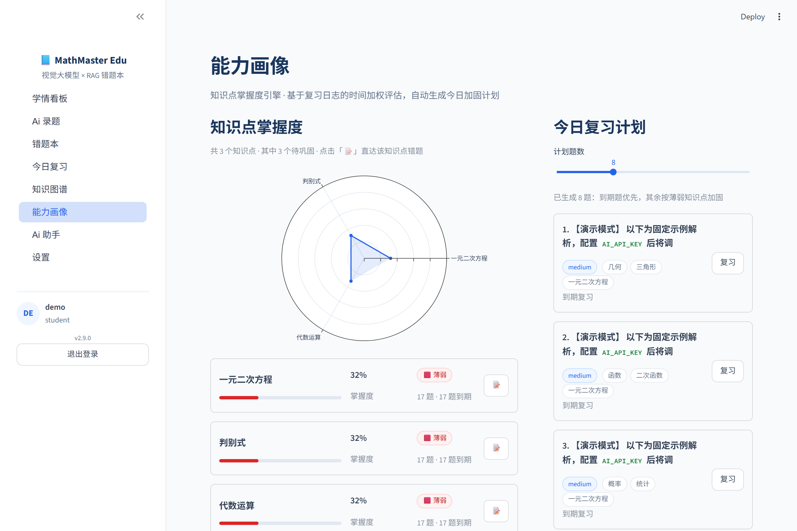
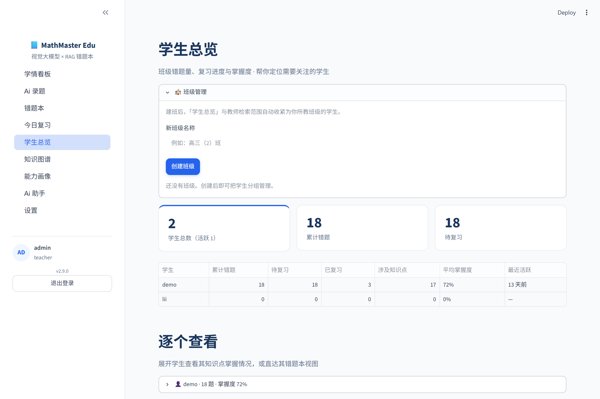
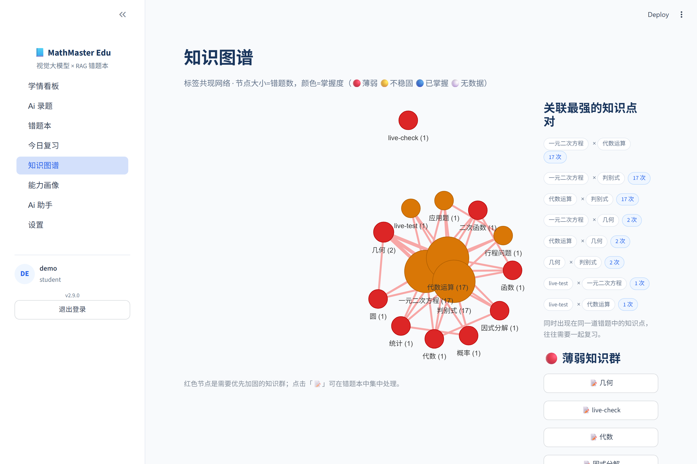
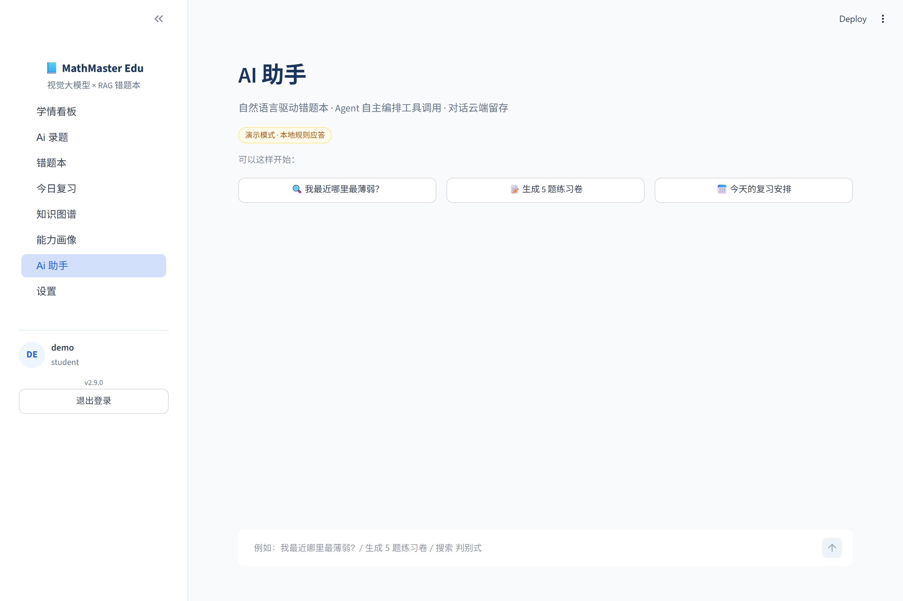

# 📘 MathMaster Edu — 基于视觉大模型与 RAG 的智能错题本

> **让错题管理像呼吸一样简单。** 拍照录入 → AI 结构化解析 → 数学验证 → 向量归档 → 掌握度画像 → 自适应复习。
>
> A production-grade Smart Wrong-Question Notebook powered by a Vision LLM, RAG retrieval, math verification, mastery tracking, and spaced-repetition scheduling.


[](https://github.com/lii-lii321/Math_Tutor_RAG/actions/workflows/ci.yml)


---

## ✨ 项目亮点 (Highlights)

| 能力 | 说明 |
|---|---|
| 📸 **AI 拍照录题** | 上传手写作业/试卷照片，视觉大模型识别题目并输出**结构化解析**（考点、分步讲解、答案、难度、易错原因、变式题），基于 Pydantic Schema 约束输出并稳健解析 |
| 🔁 **多模型提供商** | 统一 Provider 抽象：一套代码对接 **SiliconFlow / 通义千问 / 智谱 GLM / DeepSeek / OpenAI / Ollama**，更换 `AI_BASE_URL` + `AI_MODEL` 即可切换；**Gemini** 走独立 Provider（需另设 `AI_PROVIDER=gemini`）；无 Key 时自动进入演示模式，克隆即可跑通 |
| 🧠 **RAG 向量检索** | ChromaDB 持久化向量库：错题解析自动嵌入入库；**「举一反三」相似题召回**、错题本**语义搜索**（自然语言找题）；向量库故障自动降级为关键词检索 |
| 🤖 **Agent + MCP** | Tool-use 对话 Agent（function calling 循环自主编排工具）+ MCP Server（Claude Desktop / Cursor 直接调用错题本）|
| 🎯 **能力画像与自适应复习** | 规范化知识点模型 + 掌握度引擎（复习日志时间加权评估），每日计划自动组合「SM-2 到期优先 + 薄弱知识点加固」；复习页支持按计划队列复习并标注推荐理由 |
| ⏰ **间隔重复复习** | 内置 **SM-2 算法**（Anki 同源）：闪卡式复习，按记忆质量自动调度下次复习时间，对抗遗忘曲线 |
| 💬 **追问讲题** | 每道错题内置多轮对话（Chat UI）：带题目上下文的多轮讲题，上下文自动截断防超限 |
| 📊 **学情看板** | 知识点分布、**标签级掌握度估算**（复习表现 + 调度间隔的看板启发式口径，与画像页时间加权引擎并存）、薄弱知识点 Top N、近 14 天录入趋势 |
| 🖨️ **一键组卷导出** | 按筛选结果生成可打印 Word 复习卷，保留题目原图与答题留白 |
| 🔐 **生产级安全** | bcrypt 密码哈希、登录失败延迟、JWT 认证、Pydantic 入参校验、SQL 参数化查询 |
| 🔌 **FastAPI 网关** | 与 Streamlit 共享同一套 backend 服务的 REST API（JWT + OpenAPI 文档），Web / 小程序 / 脚本多端复用 |
| 🧩 **知识图谱** | 标签共现力导向图，节点颜色=掌握度（薄弱红/不稳固琥珀/已掌握蓝），薄弱知识群一键直达错题本 |
| 👨‍🏫 **教师端** | 学生总览：全班错题量/待复习/掌握度/最近活跃，逐个查看学生知识点分布；错题批注 |
| 📅 **学习日历** | 90 天热力图 + 复习正确率趋势 + 掌握度成长曲线 + 连续学习打卡 + 周报环比 |
| ⌨️ **高效复习** | 键盘快捷键（空格/1-4）、评分间隔预览、跳过、掌握归档（🏆）、复习历史 |
| 🌙 **体验细节** | 深色模式、PWA 可安装、OCR 原图搜索（可选）、MUJI 极简界面 |
| 🧪 **工程化** | pytest 收集到 287 个用例 + Playwright E2E、ruff、覆盖率 ~90%、CI（lint + 3 版本矩阵 + 启动冒烟 + E2E + Docker）、Alembic 迁移（11 个版本）、Docker Compose 一键部署、RAG 检索离线评测（Recall@K / MRR / NDCG）与 AI Tutor 评测（LLM-as-judge）、AI 遥测 |

## 🏗️ 架构 (Architecture)


```mermaid
flowchart LR
    subgraph Frontend["Frontend · Streamlit"]
        A1[登录/注册] --> A2[学情看板]
        A1 --> A3[AI 录题]
        A1 --> A4[错题本]
        A1 --> A5[今日复习]
        A1 --> A7[能力画像]
        A1 --> A8[AI 助手 · Tutor]
    end

    subgraph API["FastAPI 网关 · JWT 双令牌"]
        G1[Auth/RBAC] --> G2[REST + SSE]
        G3[班级多租户] --> G2
        G4[请求限流] --> G2
    end

    subgraph Services["backend/services · 应用服务层"]
        S1[QuestionService\n七领域 Mixin]
        S2[ReviewScheduler\nSM-2]
        S3[MasteryEngine\n掌握度+自适应]
        S4[AgentSession\nTutor + 会话持久化]
        S5[ConversationService]
        S6[JobService\n异步任务]
    end

    subgraph AI["AI 抽象层"]
        P1[OpenAI 兼容\nSiliconFlow/Qwen/GLM/DeepSeek]
        P2[Gemini]
        P3[Mock 演示模式]
        P4[Math Verification\nSymPy]
    end

    subgraph Data["数据层"]
        R1[(SQLite / MySQL\nSQLAlchemy ORM)]
        R2[(ChromaDB\n向量库)]
        R3[图片文件存储]
        R4[(Redis · 可选队列)]
    end

    A2 --> S1
    A3 --> S6
    A5 --> S2
    A7 --> S3
    A8 --> S4
    G2 --> S1
    S4 --> S5
    S1 --> P1 & P2 & P3
    S1 --> P4
    S1 --> R1
    S1 --> R2
    S1 --> R3
    S6 --> R4
    S6 --> R1
```

**分层原则**：界面层（`frontend/`）只依赖应用服务（`QuestionService` 等）；服务层通过 Repository 访问数据库；AI 提供商与向量库均可替换/降级。配置集中在 `backend/config.py`（pydantic-settings 校验）。

## 🖼️ 界面速览 (Screenshots)

| 学情看板 | AI 录题 |
|---|---|
|  |  |
| **错题本（掌握度角标 + 薄弱筛选）** | **今日复习（SM-2 闪卡）** |
|  |  |
| **能力画像（掌握度雷达 + 今日计划）** | **学生总览（教师端）** |
|  |  |
| **知识图谱（节点颜色 = 掌握度）** | **AI 助手（Agent 对话）** |
|  |  |

## 🚀 快速开始 (Quick Start)

### 方式一：本地运行（推荐 Python 3.10+）

```bash
git clone https://github.com/lii-lii321/Math_Tutor_RAG.git
cd Math_Tutor_RAG

python -m venv .venv
.venv\Scripts\pip install -r requirements.txt      # Windows
# source .venv/bin/activate && pip install -r requirements.txt   # macOS/Linux

streamlit run app.py
```

打开 http://localhost:8501 ，使用种子账号登录：

| 账号 | 密码 | 角色 |
|---|---|---|
| `admin` | `admin123` | 教师（可查看全部学生错题） |
| `demo` | `demo123` | 学生 |

> 未配置 AI Key 时应用以**演示模式**运行（返回内置示例解析），完整流程均可体验。

### 方式二：Docker 一键部署

```bash
docker compose up -d --build
# Web 访问 http://localhost:8501，REST API 访问 http://localhost:8000/docs
# 数据持久化于 named volume
```

### 方式三：单独启动 API 网关

```bash
pip install -r requirements.txt
uvicorn api.main:app --port 8000
# OpenAPI 文档: http://localhost:8000/docs
```

```bash
# 快速体验 API
curl -s -X POST http://localhost:8000/api/auth/login \
  -H "Content-Type: application/json" \
  -d '{"username": "demo", "password": "demo123"}'
# 返回 access_token，后续请求带 Authorization: Bearer <token>
```

> `.env` 中设置 `AUTH_SECRET` 为强随机密钥（≥ 32 字节）以保护 JWT 签名。

### 启动 MCP Server（Claude Desktop / Cursor 接入）

```bash
pip install -r requirements.txt
# Claude Desktop 的 claude_desktop_config.json 中添加：
# "mcpServers": { "mathmaster": { "command": "python", "args": ["-m", "mcp_server"],
#                 "cwd": "<项目路径>" } }
python -m mcp_server   # stdio 传输，验证可用
```

接入后即可在 MCP 客户端中用自然语言：搜索错题、录入错题、评分复习、查周报。

### 启用真实 AI 模型

复制 `.env.example` 为 `.env`，任选一家 OpenAI 兼容服务填入即可（也可接 Gemini 或本地 Ollama）：

```ini
AI_PROVIDER=openai_compatible
AI_BASE_URL=https://api.siliconflow.cn/v1
AI_API_KEY=sk-xxxx
AI_MODEL=Qwen/Qwen2.5-VL-32B-Instruct
```

可选：接入远程中文嵌入模型提升检索效果（默认使用 ChromaDB 内置本地模型，零外部依赖）：

```ini
EMBEDDING_BASE_URL=https://api.siliconflow.cn/v1
EMBEDDING_API_KEY=sk-xxxx
EMBEDDING_MODEL=BAAI/bge-m3
```

## 📖 功能导览

1. **AI 录题** — 上传错题照片 → 获得考点分析 / 分步讲解 / 答案 / 难度 / 易错原因 / 变式练习 → 自动归档并写入向量库 → 展示「举一反三」相似历史错题。
2. **错题本** — 关键词 + 语义双路搜索；按标签筛选；在线编辑（编辑后向量索引同步更新）；批量删除；一键导出 Word 复习卷；**追问讲题**多轮对话。
3. **今日复习** — 闪卡式复习：看题回忆 → 显示解析 → 按掌握程度评分（忘了/勉强/记得/秒懂）→ SM-2 自动安排下次复习时间。
4. **学情看板** — 累计错题、待复习数、知识点分布环形图、薄弱知识点掌握度条、近 14 天录入趋势。

## 🧪 测试与质量

```bash
pip install -r requirements-dev.txt
pytest -v          # 收集到 287 个用例：认证 / 仓储 / SM-2 调度 / AI 解析 / RAG / 统计 / 导出 等
ruff check .       # 静态检查
```

GitHub Actions 在每次 push / PR 时执行 4 个 job：`ruff lint → pytest (3.10/3.11/3.12 矩阵 + 覆盖率) → 启动冒烟（Streamlit / API 健康检查 + Playwright E2E）→ Docker 构建`。

部署到服务器 / 云端的完整步骤（含 MySQL 切换、备份策略、常见问题）见 **[docs/DEPLOYMENT.md](docs/DEPLOYMENT.md)**。

## 📁 目录结构

```
Math_Tutor_RAG/
├── app.py                     # Streamlit 入口（路由 + 侧边栏）
├── api/                       # FastAPI 网关（REST API，多端复用）
│   ├── main.py                # 应用工厂 + CORS + OpenAPI
│   ├── deps.py                # JWT 认证 / 会话依赖
│   └── routers/               # auth / questions / review / stats
├── backend/
│   ├── config.py              # pydantic-settings 配置中心
│   ├── database.py            # SQLAlchemy 引擎 / 会话 / 初始化
│   ├── models/
│   │   ├── orm.py             # User / Question / ReviewLog
│   │   └── schemas.py         # Pydantic 契约（含 AI 结构化输出 Schema）
│   ├── repositories/          # 数据访问层（用户 / 错题）
│   ├── services/
│   │   ├── ai/                # AI 提供商抽象：OpenAI 兼容 / Gemini / Mock
│   │   ├── rag.py             # ChromaDB 向量库封装（含降级策略）
│   │   ├── review.py          # SM-2 间隔重复调度器
│   │   ├── stats.py           # 标签统计 / 掌握度 / 活跃度
│   │   ├── auth.py            # 认证服务
│   │   ├── export.py          # Word 组卷导出
│   │   └── question_service.py# 错题编排服务（界面层唯一入口）
│   └── utils/                 # 日志 / 密码哈希
├── frontend/
│   ├── pages/                 # auth / dashboard / tutor / notebook / review / settings
│   ├── common.py              # 样式、缓存、公共组件
│   └── assets/style.css       # MUJI 极简主题
├── tests/                     # pytest 测试套件
├── docs/ARCHITECTURE.md       # 架构决策说明
├── Dockerfile / docker-compose.yml
└── .github/workflows/ci.yml   # lint + 测试矩阵 + Docker 构建
```

## 🗺️ 路线图 (Roadmap)

- [x] ~~知识点图谱可视化（标签共现网络）~~（v2.1）
- [x] ~~FastAPI 网关化以便多端复用~~（v2.1）
- [x] ~~学习日历热力图 / 正确率趋势 / 连续学习打卡~~（v2.1）
- [x] ~~教师端学生总览~~（v2.1）
- [x] ~~PostgreSQL 支持~~（v2.10：`DATABASE_URL` 一键切换 + compose `--profile postgres`，迁移链与测试套件已在 PG 16 实机验证）
- [ ] 对象存储（S3/OSS）托管题目图片
- [ ] OpenTelemetry 观测埋点
- [x] ~~消息队列异步解析~~（v2.3 异步录题 + v2.6 JobQueue 抽象：默认进程内线程，`REDIS_URL` 切换 RQ + 独立 Worker）

## ⚠️ 已知限制 (Known Limitations)

- 登录失败限流为进程内实现，多实例部署需换用 Redis 等共享存储
- 异步解析队列默认为进程内线程实现；多实例部署需配置 `REDIS_URL` 切换 RQ 队列 + 独立 Worker
- 语义搜索的向量检索范围：学生仅本人错题；教师默认为 自己 + 全部学生，建班后收紧为「自己班级的学生」
- PostgreSQL 为兼容验证通过（迁移链 + 测试套件 + API 冒烟在 PG 16 实机验证），日常开发默认仍为 SQLite
- 错题图片存储于本地磁盘（`data/images/`），云对象存储接入在路线图中

## 📄 License

[MIT](LICENSE)
